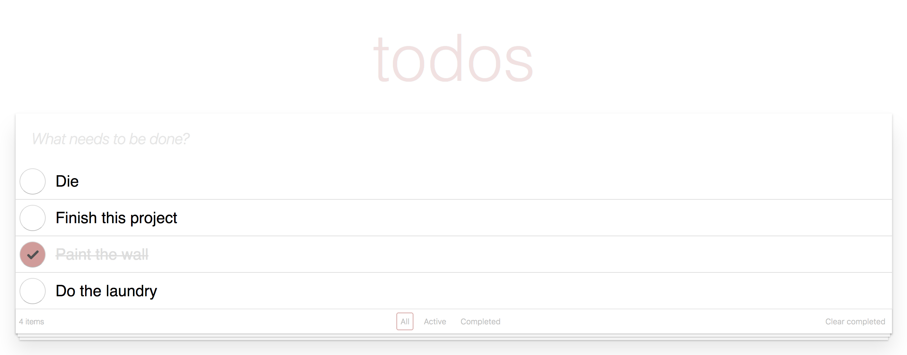

# React Context Todo App
A react todo app created using the new context api.

### Project Structure
To improve the understanding, the project has been structured in this way:

```
  src/ -> source code root.
  src/modules -> set of components or functions from a specific domain, like helpers and contexts.
  src/components -> react components.
  src/flowtypes -> reusable flow types.
``` 

### Stack
To achieve the todo app creation goals, I've used some already existing libraries and frameworks listed below:

 - EcmaScript6
 - [React](http://reactjs.org/)
 - [React Context API](https://reactjs.org/docs/context.html) -  application state management.
 - [Flow](https://github.com/facebook/flow) - static typing for javascript.
 - [Styled Components](https://github.com/styled-components/styled-components) - primitive components styling.
 - [Create React App](https://github.com/facebook/create-react-app/blob/master/packages/react-scripts/template/README.md#adding-images-fonts-and-files) - easy build configuration and faster development.
 - [Jest](https://github.com/facebook/jest) & [Enzime](https://github.com/airbnb/enzyme) - unit and component tests.
 - [Prettier](https://prettier.io/) - Code formatter.
 - [Airbnb eslint config](https://github.com/airbnb/javascript/tree/master/packages/eslint-config-airbnb) - linter base configuration.
 - [Husky](https://github.com/typicode/husky) - git hooks.
 - [Lint-staged](https://github.com/okonet/lint-staged) - pre-commit linter and prettier execution.

### Up and Running

```
  yarn install
  yarn start
```

### Tests
```
  yarn test
```
